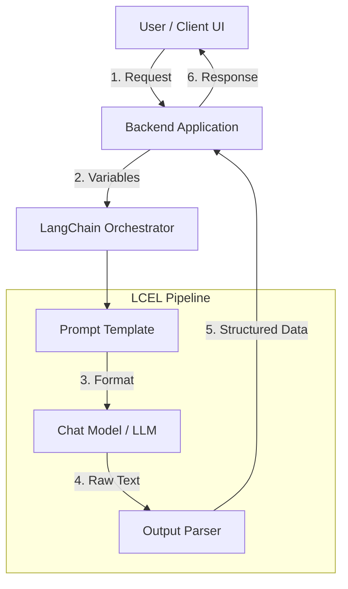

# 🦜🔗 AI Engineering Track: Introduction to LangChain

Welcome to **Today's Task – AI Engineering Track**! This repository explores **LangChain**, why it has become the industry-standard framework for building production-grade AI applications, and demonstrates how its core components work together through modern **LangChain Expression Language (LCEL)**.

---

## 🌟 Topics Explored

### 1. What is LangChain?
At its core, **LangChain** is an open-source orchestration framework designed to simplify the development of applications powered by Large Language Models (LLMs). While an LLM alone is just a stateless text engine, real-world AI applications require complex workflows:
- Integrating external data sources (databases, APIs, documents).
- Managing conversational memory and state.
- Structuring raw text responses into predictable application data types.
- Chaining multiple sequential or parallel LLM calls together.

> 💡 **The Analogy:** If an LLM is a powerful car engine, **LangChain** provides the chassis, steering wheel, transmission, and GPS navigation that turn that engine into a drivable vehicle.

---

### 2. Why Use LangChain Instead of Calling an LLM API Directly?
When building a simple proof-of-concept, calling SDKs directly is straightforward. However, as an application scales into production, direct API calls introduce significant architectural debt.

| Dimension | Direct LLM API Calls | LangChain Framework |
| :--- | :--- | :--- |
| **Model Swapping** | Requires refactoring API endpoints, payload schemas, and authentication logic. | **Model-Agnostic:** Change `ChatOpenAI()` to `ChatGoogleGenerativeAI()` with zero code refactoring in your chain. |
| **Prompt Engineering** | Hardcoded f-strings spread across the codebase; prone to injection risks and messy formatting. | **Prompt Templates:** Reusable, modular, versionable prompts with input validation and chat-role structuring. |
| **Output Handling** | Writing custom regex or fragile JSON parsing logic to clean raw LLM output strings. | **Output Parsers:** Built-in parsers (`StrOutputParser`, `JsonOutputParser`, Pydantic) that guarantee structured data. |
| **Workflow Orchestration** | Nested `try/except` blocks and manual passing of variables between multiple API calls. | **LCEL Chains:** Declarative Unix-style pipe syntax (`prompt \| llm \| parser`) with automatic async, streaming, and retry support. |

---

### 3. Core Components
LangChain applications are built using composable components:
- **Chat Models:** Standardized wrappers around chat-based LLMs (like Google Gemini / Gemma) that exchange structured message objects (`SystemMessage`, `HumanMessage`, `AIMessage`).
- **Prompt Templates:** Separate dynamic user input from static instructions, allowing parametrized prompt generation.
- **Output Parsers:** Transform unstructured raw LLM text into structured Python data types (strings, dictionaries, Pydantic models).
- **Chains (LCEL):** The declarative pipe (`|`) syntax connecting Prompts $\rightarrow$ LLMs $\rightarrow$ Parsers into executable pipelines with built-in streaming and async capabilities.

---

### 4. Common AI Application Architecture



---

## 🛠️ Practical Task Implementation

In this project (`main.py`), we implement all practical requirements for Today's Task:
1. **Dependencies & Setup:** Configured with `langchain-core` and `langchain-google-genai`.
2. **First Chat Model:** Initializes `ChatGoogleGenerativeAI(model="gemma-4-26b-a4b-it")`.
3. **Prompt Template Experimentation:** Asks the core question (*"What is LangChain and why should developers use it?"*) using a **Prompt Template**:
   - 👶 **ELI5 (Explain Like I'm 5):** Forces simple Lego brick analogies and under 3 sentences.

---

## 🚀 How to Run

1. **Activate Virtual Environment:**
   ```powershell
   .\venv\Scripts\activate
   ```
2. **Execute the Practical Pipeline:**
   ```powershell
   python main.py
   ```

You will observe in the terminal output how the AI model drastically adapts its terminology, structure, and tone based solely on the prompt template while maintaining the same underlying Chat Model and output parser!
